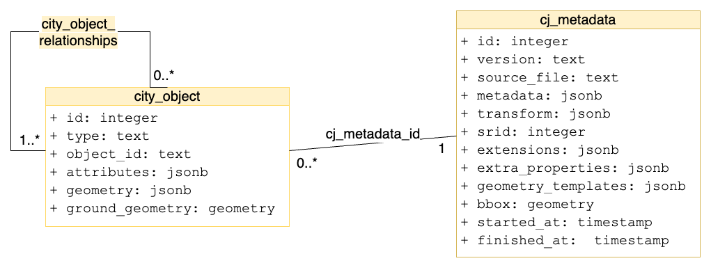

# cjdb data model
cjdb data model is designed to store 3D city models in CityJSON in a PostgreSQL/PostGIS database.


## The data model used 

The conceptual data model contains two main tables. The **cj_metadata** table for storing imported files' information, e.g. name or metadata of the source file. The **city_object** table for storing city objects. 

The physical data model adds one more table on the conceptual data model: the **city_object_relationships** table to store relations between city objects, e.g the parent-children relationship. This table is added to achieve higher querying speed when selecting objects by their parent/child relationship. Example of this would be: "give me all the objects which are children of X". 




### cj_metadata 

The `cj_metadata` table stores information from imported files, e.g. name or metadata of the source file. 

 - **id**: cj_metadata record's index within the database.
 - **version**: CityJSON version used.
 - **source_file**: name of the source file.
 - **metadata**: [CityJSON metadata object](https://www.cityjson.org/specs/#metadata), a JSON object describing the creator, dataset extent or coordinate reference system used, etc.
 - **transform**: [CityJSON transform object](https://www.cityjson.org/specs/#transform-object), a JSON object describing how to decompress the integer coordinates of the geometries to obtain real-world coordinates.
 - **srid**: Coordinate reference system (CRS) of the imported city objects in the database. If not specified when importing, the CRS will be the same with the source file's CRS. If specified when importing, the CRS will be the specified CRS.
 - **extensions**: [CityJSON Extensions](https://www.cityjson.org/specs/#extensions), a JSON file that documents how the core data model of CityJSON is extended.
 - **extra_properties**: [extraRootProperties](https://www.cityjson.org/specs/#case-2-adding-new-properties-at-the-root-of-a-document), a JSON object with added new properties at the root of the imported document.
 - **geometry_templates**: [CityJSON geometry-templates object](https://www.cityjson.org/specs/#geometry-templates), a JSON object containing the templates that can be reused by different City Objects (usually for trees).
 - **bbox**: bounding box is taken from the `geographicExtent` object from the `metadata` section
 - **started_at**: importing start time.
 - **finished_at**: importing finish time. `null` if not finished.


### city_object 

The `city_object` model stores individual city objects, for instance buildings, roads, or bridges. Its attributes are described below. 
The **attributes** and **geometry** are seperated into two jsonb column for query optimization purpose.

  - **id**: city object's index within the database.
  - **cj_metadata_id**: the source file id of the city object, foriegn key to the id column of metadata table.
  - **type**: type of the city object (e.g. building, buildingparts, etc.).
  - **object_id**: the identification string of the city object (e.g. NL.IMBAG.Pand.0503100000000033-0).
  - **cj_metadata_id**: the source file id of the city object, foriegn key to the id column of metadata table.
  - **attributes**: [cityJSON attributes](https://www.cityjson.org/specs/#attributes-for-all-city-objects), a JSON object that describes attributes of the city object (e.g. roof type, area, etc.).
  - **geometry**: [cityJSON geometry](https://www.cityjson.org/specs/#geometry-objects), a JSON object that describes the geometry of the city object.
  - **ground_geometry**: the 2D footprint of the city object, in PostGIS geometry type.


### city_object_relationships

The `city_object_relationships` model stores the relations between city objects.

  - **id**: city_object_relationships index within the database.
  - **parent_id**: the id of the parent object.
  - **child_id**: the id of the child object.


## Indexing

Indexing certain columns or [expressions](https://www.postgresql.org/docs/current/indexes-expressional.html) speeds up querying on them. 

The users can use GIN index on lod, to speed up queries on geometries:

```sql
CREATE INDEX lod ON cjdb.city_object USING GIN (geometry jsonb_path_ops);
```

The users can use B-tree partial index on attributes, these will slightly increase the query speed.


